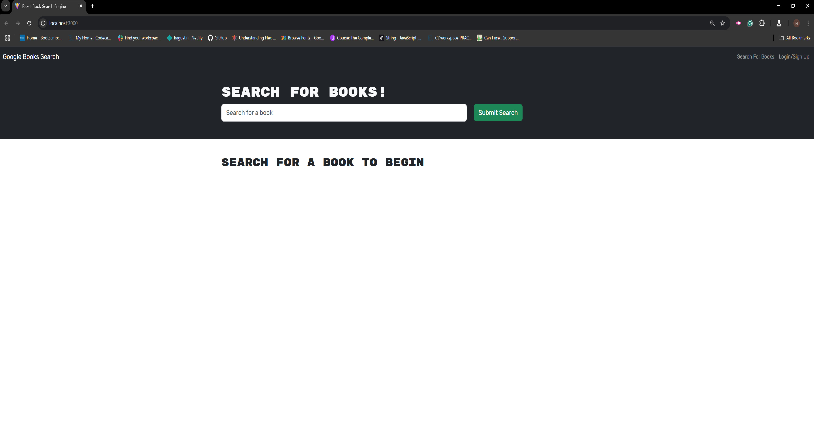
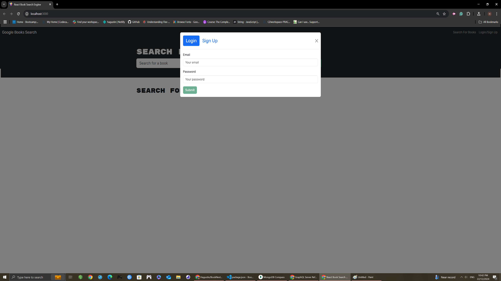
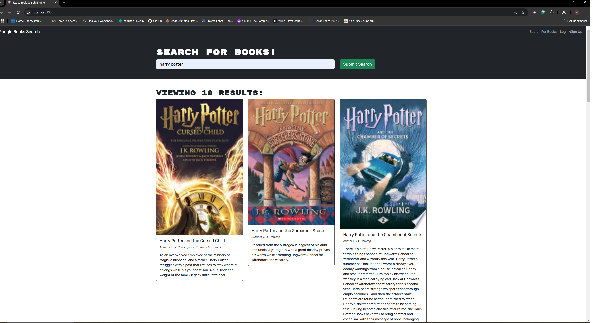

# 📚 BookNest - GraphQL Book Search App

Welcome to **BookNest**, a full-stack web application that allows users to search for books, save their favorite titles, and manage personal reading lists. This project is built using modern technologies like GraphQL, Apollo Client, Express.js, MongoDB, and React.

---

## 🚀 Live Demo
🔗 [https://booknest-graphql.onrender.com](#)

---

## 🛠️ Technologies Used

- **Frontend:** React, TypeScript, Apollo Client, React Bootstrap
- **Backend:** Node.js, Express.js, Apollo Server, MongoDB, Mongoose
- **Authentication:** JWT (JSON Web Token)
- **API Integration:** Google Books API

---

## 🎯 Features

✅ User Authentication (Signup/Login)  
✅ Search for Books using Google Books API 📚  
✅ Save Favorite Books 📖  
✅ Remove Saved Books ❌  
✅ Responsive Design for Mobile and Desktop 📱💻

---

## 📸 Screenshots

### 1. **Home Page**


### 2. **Login & Signup Modal**


### 3. **Book Search Results**



---

## 📂 Folder Structure

```
📁 client   -> Frontend (React)
📁 server   -> Backend (GraphQL + MongoDB)
```

---

## 🚀 Getting Started

1. Clone the repository:
   ```bash
   git clone https://github.com/Hagustin/BookNest-GraphQL.git
   cd BookNest-GraphQL
   ```

2. Install dependencies:
   ```bash
   npm install
   ```

3. Create a `.env` file in the `server` directory with the following variables:
   ```env
   JWT_SECRET_KEY=your_jwt_secret
   MONGODB_URI=mongodb://localhost:27017/booknest
   GOOGLE_BOOKS_API_KEY=your_google_books_api_key
   ```

4. Build the application:
   ```bash
   npm run build
   ```

5. Run the application:
   ```bash
   npm run develop
   ```

---

## 📖 API Endpoints

### GraphQL Queries & Mutations

- `GET_ME` - Retrieve user data.
- `LOGIN_USER` - Authenticate a user.
- `ADD_USER` - Register a new user.
- `SAVE_BOOK` - Save a book to the user's account.
- `REMOVE_BOOK` - Remove a saved book.

---

## 🧪 Testing and Deployment

- **Testing:** Use Apollo Client DevTools and Insomnia for API testing.
- **Deployment:** Deployed on [Render](https://booknest-graphql.onrender.com).

---

## 🤝 Contributing

Contributions are welcome! Feel free to submit issues or pull requests.

---

## 📜 License

This project is licensed under the MIT License.

---

## ✨ Acknowledgments

- Google Books API for book data 📚
- React Bootstrap for UI components 🎨
- Apollo Client & Server for GraphQL integration 🚀

---

## 📬 Contact

For questions or collaboration, reach out at ![henry1192_2004@live.com.au].

---

🎉 Thank you for visiting **BookNest**! Happy reading! 📖✨

